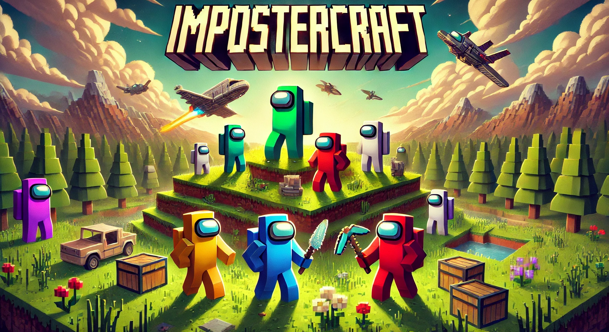

### What is ImposterCraft?
ImposterCraft brings thrilling deception, teamwork, and mystery into Minecraft! Inspired by popular social deduction games with an added twist, ImposterCraft pits a team of Crewmates against one or more Imposters in a fight for survival and trust. The twist? We have added new roles to the game enabling a more unique experience! Play as the bomber and blow up the crewmates, or become the engineer and vent as crew! Each round, players are assigned roles and tasked with completing objectives or eliminating foes without raising suspicion.  
  
## Features
 - Unique roles to enhance game experience
 - Fun crewmate tasks
 - Imposter sabotages
 - Venting
 - Cameras
 - Close doors
 - Corpses
 - Enable 2 imposters
 - Highly customisable
 - Join signs

## Roles
Imposter roles:
 - Bomber - blow up the crew!
 - Janitor - sweep dead bodies to never be found!
 - Guesser - guess crewmate roles to kill during meetings!
 - Bounty Hunter - kill 3 bounties to win the game!
 - Camouflager - turn invisible for 10 seconds at a time!

Crewmate roles:
 - Sheriff - kill imposters, don't get it wrong!
 - Engineer - you can use vents!
 - Deputy - handcuff players to stop them killing!
 - Mayor - your vote counts twice!
 - Protector - protect players for limited time to stop them from being killed!
 - Lighter - you can see in the dark!

_More coming soon..._

Commands
**/imposter help** - list all the available ImposterCraft commands
**/imposter list** - list all arenas
**/imposter join** <arena id> - join an arena
**/imposter leave** - leave an arena

Admin commands:
**/imposter create** - create a new arena
**/imposter lobby {arena id / 'main'}** - set the lobby spawn point for an arena or the main lobby.
**/imposter spawn <arena id>** - set the spawn points for an arena. You can set up to 12 per arena.
**/imposter reset <arena id>** - reset an arena.
**/imposter task <task id> <arena id>** - create a new task location. Get the task ids from list below.
**/imposter meeting <arena id>** - create the emergency meeting button location.
**/imposter door <item id> <door category> <arena id>** - set a door location for an arena. Use /imposter wand to set the location.
**/imposter vent <vent category> <arena id>** - create a new vent location.
**/imposter cameras create <arena id>** - create the cameras join sign.
**/imposter cameras set <arena id>** - set a camera location.
**/imposter wand** - get the ImposterCraft wand.

## How to setup
_**Please read this carefully when setting up your arenas._

_How to create an arena?_
/imposter create

_How do I setup tasks and sabotages?_
First, use the "/imposter task <task id> <arena id>" to get the sign. Place the sign anywhere you want. To delete the task, just break the sign. Get the task id from the list below.  
**You must place at least one of each task and 2 Reactor meltdown and Oxygen Depletion sabotages for your arena to be ready to play.

_How do I create vents?_
Type "/imposter vent <vent category> <arena id>". Place the trapdoor where ever you want. To delete the vent, just break the trapdoor.

_How do I create doors?_
First you need the ImposterCraft Wand, type "/imposter wand". Right click two blocks with the wand to set your door locations. Finally, type "/imposter door <item id> <door category> <arena id>". Change item id to the block of your choice. Enter a door category. You can reuse this door category to close more than 1 door at a time.

_How do I enable cameras?_
Firstly, you need to create a camera join location, type "/imposter cameras create <arena id>". Place this sign anywhere.
To create camera locations, move to the desired location and type "/imposter cameras set <arena id>".

_Can I create a lobby spawn point?_
Of course! Type "/imposter lobby <arena id>" to set lobby spawn for an arena. To set the main lobby, type "/imposter lobby main".

_How to set the emergency meeting button?_
Type "/imposter meeting <arena id>" and place the sign anywhere.

_Can I set game spawn points?_
Of course! Type "/imposter spawn <arena id>" in the desired location. You can set up to 12 spawn points per arena.

## Dependencies
This plugin is dependent on ProtocolLib - Please make sure you have downloaded ProtocolLib jar and placed in your plugins folder! For 1.21.1+, use latest dev release. You can download ProtocolLib [here](https://www.spigotmc.org/resources/protocollib.1997/).